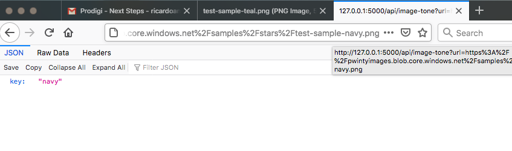
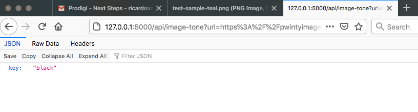
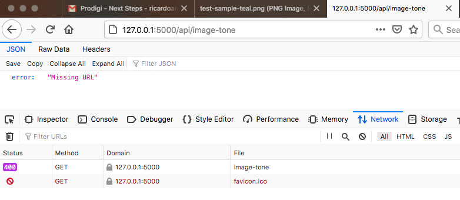
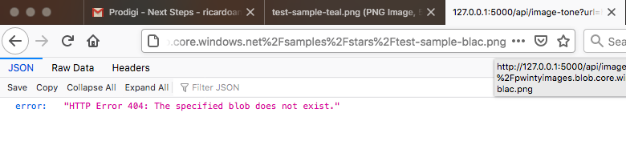
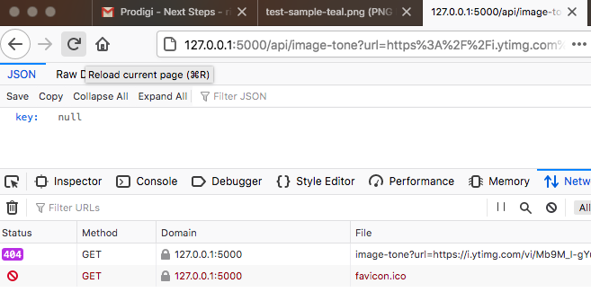

## Endpoints to assert the modal colour in a image

Early experience with Flask, Django being less suitable for plain 'endpoints' and without any databases involved.

The approach was to get the most frequent colour in the image provided and assert a square difderence of its components against the reference keys _teal_, _grey_, _black_ and _navy_.

The first one to hold a difference smaller than this (arbitrary) threshold is elected for output.


### Installation

1. After cloning the repo start a python3 virtualenv on it and install the required dependencies:
```
    $ cd img_modal_colour
    img_modal_colour$ python3 -m venv .
    (img_modal_colour)img_modal_colour$ pip install -r requirements.txt
```
2. Start the Flask development server:
```
   (img_modal_colour)img_modal_colour$ FLASK_ENV=development flask run 
``` 
It should start the server on http://127.0.0.1:5000

3. On your browser access the endpoint directly by entering

```http://127.0.0.1:5000/api/image_tone?url=<uri-encoded-image-url>```

In the address bar.

_I used a browser javascript console to encode the sample urls_:
```
    > encodeURIComponent('https://pwintyimages.blob.core.windows.net/samples/stars/test-sample-teal.png')
    <- "https%3A%2F%2Fpwintyimages.blob.core.windows.net%2Fsamples%2Fstars%2Ftest-sample-teal.png"
```
I then copy+paste to the address bar following `?url=`


### Notes
1. As I write these note, I browse at https://stackoverflow.com/questions/3241929/python-find-dominant-most-common-color-in-an-image 
which suggests, amongst others, that Pillow.getcolors() could get the colour frequency in a single step, potencialy faster
2. Given the cost of assessing all pixels' colours I decided to risk doing it over the upper-left quadrant only. 
The `Pillow.reduce()` method might produce more reliable results while addressing performance and still assessing all regions of the image. 

### Sample images
_navy_


_black_


_missing URL_ 400


_blob not found_ 404


_no match_ 404

